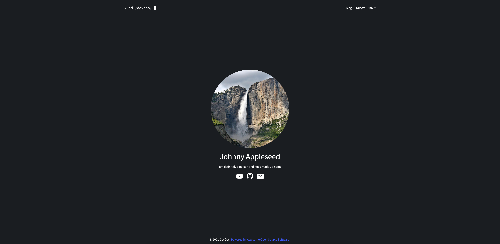

# DevOps Theme

The **DevOps** Theme is for [Grav CMS](http://github.com/getgrav/grav).

## Description

An elegant developer-inspired dark theme for Grav.

## Features

### Full page landing with profile module



The `landing` template supports both regular content and optionally modules. You can add a module using the `profile` template under the `landing` template to create a full page profile as shown above.

You'll need to make sure your page using the `landing` template has the following Frontmatter:

```yaml
content:
    items: '@self.modular'
```

You'll also want to configure the module by adding the following to the Frontmatter in the page that uses the `profile` template:

```yaml
profile:
    name: 'Johnny Appleseed'
    quip: 'I am definitely a person and not a made up name.'
    photo: demo_banner.jpeg
    socials:
        facebook: 'https://facebook.com/johnnyappleseed'
        instagram: 'https://instragram.com/johnnyappleseed'
        twitter: 'https://twitter.com/johnnyappleseed'
        linkedin: 'https://linkedin.com/johnnyappleseed'
        youtube: 'https://youtube.com/johnnyappleseed'
        github: 'https://github.com/johnnyappleseed'
        email: johnny@appleseed.com
```

**Note:** The `photo` setting is looking for a photo uploaded to the folder that your page using the `profile` template is placed.

### Blog support

You can create a blog simple by create a blog home page using the `blog` template and putting the snippet below into it's Frontmatter.

```yaml
content:
    items: '@self.children'
```

You can then create posts by adding subpages to the blog page using the `item` template.

### Blog pagination

Pagination support is available to the `blog` template by installing the [pagination plugin](https://github.com/getgrav/grav-plugin-pagination).

### Customizable navbar and footer text

You can customize the text that shows up in the navbar and footer from within the Grav Admin.

### Easy favicons

DevOps supports easily adding a custom favicon from within the administration theme settings. Before uploading your favicons, you'll want to add `.ico` to your media configuration by adding an entry for `ico` with the type `image` and the mime type of `image/x-icon`. After this is completed you can then upload your icons and add the custom meta and link tags right in the theme settings. I would recommend using [realfavicongenerator.net](https://realfavicongenerator.net/) since it generates the icons and the tags required.

## Available templates

- Default view template `default.md`
- Landing view template `landing.md`
    - Profile modular view template `profile.md`
- Error view template `error.md`
- Blog view template `blog.md`
    - Blog item view template `item.md`
- Simple view template `simple.md`

## Installation

You can install this theme like any other theme in Grav. See the default [Quark](https://github.com/getgrav/grav-theme-quark) theme for more details.

## License

This theme is licensed use the MIT license available [here](LICENSE).
